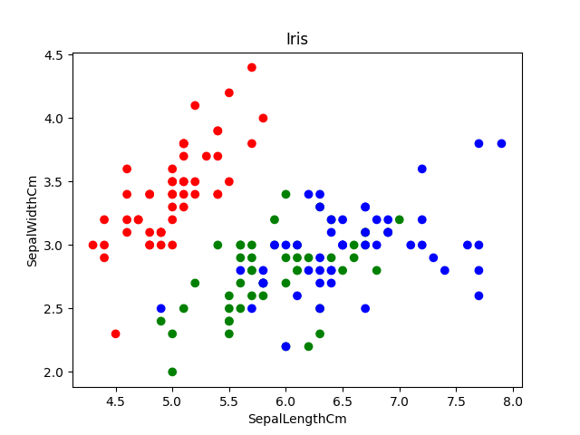

# One-Vs-Rest Classification Using the Perceptron

## Introduction

### Project Overview
The perceptron project aimed to implement and evaluate a basic neural network model known as the perceptron. The perceptron is a fundamental building block in machine learning, particularly in binary classification tasks. This project focused on understanding its workings, implementing it from scratch, and evaluating its performance on a dataset.

### Objectives
- Implement the perceptron algorithm to perform one-Vs-rest classification.
- Evaluate the perceptron's accuracy and performance metrics.
- Demonstrate proficiency in understanding foundational machine learning concepts and coding skills.

## Methodology

### Perceptron Algorithm
The perceptron algorithm is a supervised learning technique used for binary classification. It learns a decision boundary that separates the classes based on input features.

#### Implementation Details
- Implemented in Python using NumPy for matrix operations.
- Utilized a step function as the activation function.

### Dataset
- Used the Iris dataset for demonstration purposes.
- Features included sepal and petal dimensions.
- Two target classes: Setosa (1) and rest (0).
- The perceptron was trained on 2 features: sepal width and length. The data distribution looks as follows:

## Results
The primary objective of this project was to successfully implement the perceptron algorithm and evaluate its performance in correctly classifying Iris flowers based on their sepal length and width measurements. The perceptron, a fundamental supervised learning algorithm for binary classification tasks, was meticulously implemented and trained using the Iris dataset.

Through iterative training epochs, the perceptron effectively learned to discern patterns in the dataset. The trained model demonstrated an impressive ability to differentiate Setosa from other Iris flowers with a high degree of accuracy, namely 99.3%. The results can be seen on the graph below where red data points are Setosa flowers.

